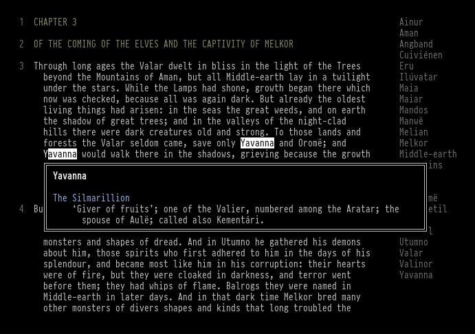

# reading.vim

a reading environment for vim, built on [goyo.vim](https://github.com/junegunn/goyo.vim)

## features

- paragraph numbers in the left margin (textnr)
- wiktionary + local dictionary lookup in a popup
- word list of recent lookups in the right margin

## requires

- vim 9.0+
- [goyo.vim](https://github.com/junegunn/goyo.vim)

## install

copy or symlink to `pack/plugins/start/reading.vim`

or as a git submodule:

    git submodule add <url> pack/plugins/start/reading.vim

## mappings

`K` is mapped to `:Define` in reading buffers. the others are `<Plug>` mappings you can bind yourself (these are [tpope](https://github.com/tpope/vim-unimpaired/blob/master/doc/unimpaired.txt#L77-L95) flavored):

    nmap yoo <Plug>(ReadingToggle)
    nmap yoN <Plug>(TextNrToggle)
    nmap yoW <Plug>(WiktListToggle)

`:ReadingToggle` enters goyo and enables all pads in one shot. the individual toggles flip pieces mid-session.

see `:help reading.txt` for full documentation
